<!-- ══════════════════ CUSTOM BANNER ══════════════════ -->

 

<!-- TYPING SVG -->

 

<!-- ══════════════════════════════════════════════════════ -->
<!--                       ABOUT ME                        -->
<!-- ══════════════════════════════════════════════════════ -->

##  &nbsp;`whoami`

<table>
<tr>
<td>

**🎓 B.E. Electronics Engineering** — *VLSI Design & Technology*
 
**🏛️ Chennai Institute of Technology** (CIT) &nbsp;`2025 – 2029`

 

> 🔬 &nbsp; **Core Domain**
>
> 
> 
> 
> 
> 
> 

> ⚡ &nbsp; **Also Focused On**
>
> 
> 
> 

 

*"I don't just write code — I architect silicon."*

</td>
</tr>
</table>

<!-- ══════════════════════════════════════════════════════ -->
<!--                   VLSI DESIGN FLOW                    -->
<!-- ══════════════════════════════════════════════════════ -->

## 🔬 VLSI Design Flow — My Playground

<!-- ══════════════════════════════════════════════════════ -->
<!--              EDA & SEMICONDUCTOR TOOLCHAIN             -->
<!-- ══════════════════════════════════════════════════════ -->

## ⚙️ EDA & Semiconductor Toolchain

### 🧪 VLSI EDA & Circuit Simulation

<table>
<tr>
<td align="center" width="130">

 <b>Virtuoso</b>
 <code>Schematic · Layout</code>
</td>
<td align="center" width="130">

 <b>Verdi</b>
 <code>Debug · Waveform</code>
</td>
<td align="center" width="130">

 <b>Ngspice</b>
 <code>SPICE Simulation</code>
</td>
<td align="center" width="130">

 <b>LTspice</b>
 <code>Analog Sim</code>
</td>
</tr>
<tr>
<td align="center" width="130">

 <b>eSim</b>
 <code>Mixed Signal</code>
</td>
<td align="center" width="130">

 <b>KiCad</b>
 <code>PCB Design</code>
</td>
<td align="center" width="130">

 <b>EasyEDA</b>
 <code>Schematic · PCB</code>
</td>
<td align="center" width="130">

 <b>SCS</b>
 <code>Spectre</code>
</td>
</tr>
</table>

 

### 🧬 HDL & Verification

<table>
<tr>
<td align="center" width="160">

 <b>Verilog HDL</b>
 <code>RTL Design · Testbench</code>
</td>
<td align="center" width="160">

 <b>SPICE Netlists</b>
 <code>Circuit Simulation</code>
</td>
<td align="center" width="160">

 <b>RTL Verification</b>
 <code>Functional · Timing</code>
</td>
</tr>
</table>

<!-- ══════════════════════════════════════════════════════ -->
<!--               EMBEDDED · IoT · HARDWARE               -->
<!-- ══════════════════════════════════════════════════════ -->

## 🛠️ Embedded Systems · IoT · Hardware

<table>
<tr>
<td align="center" width="140">

 <b>STM32F4VE</b>
 <code>ARM Cortex-M4</code>
</td>
<td align="center" width="140">

 <b>NXP</b>
 <code>MCU Platforms</code>
</td>
<td align="center" width="140">

 <b>Raspberry Pi</b>
 <code>SBC · Edge Node</code>
</td>
<td align="center" width="140">

 <b>Arduino</b>
 <code>Uno · Nano</code>
</td>
</tr>
<tr>
<td align="center" width="140">

 <b>Custom PCB</b>
 <code>Schematic → Layout</code>
</td>
<td align="center" width="140">

 <b>ARM Cortex</b>
 <code>Architecture</code>
</td>
<td align="center" width="140">

 <b>IoT Systems</b>
 <code>Ultra-Low-Power</code>
</td>
<td align="center" width="140">

 <b>Sensors & Actuators</b>
 <code>Interfacing</code>
</td>
</tr>
</table>

<!-- ══════════════════════════════════════════════════════ -->
<!--            DEEP LEARNING · EDGE AI · CV               -->
<!-- ══════════════════════════════════════════════════════ -->

## 🧠 Deep Learning · Edge AI · Computer Vision

```mermaid
%%{init: {'theme': 'dark', 'themeVariables': { 'primaryColor': '#238636', 'primaryBorderColor': '#7ee787', 'primaryTextColor': '#e6edf3', 'lineColor': '#7ee787', 'secondaryColor': '#0b3d0b', 'tertiaryColor': '#0d1117', 'fontSize': '13px'}}}%%
flowchart TD
    A["🖥️ Train on GPU"] --> B["🧠 CNN\nResNet"]
    A --> C["👁️ YOLO\nReal-time Detection"]
    A --> D["🔗 Siamese MobileNet\nSimilarity Matching"]
    B --> E["📦 Quantize & Optimize"]
    C --> E
    D --> E
    E --> F["🔬 Deploy to Edge"]
    F --> G["STM32"]
    F --> H["Raspberry Pi"]
    F --> I["Edge TPU"]

    style A fill:#161b22,stroke:#7ee787,stroke-width:2px
    style E fill:#0b3d0b,stroke:#7ee787,stroke-width:2px
    style F fill:#238636,stroke:#7ee787,stroke-width:3px
    style G fill:#0b3d0b,stroke:#58a6ff,stroke-width:2px
    style H fill:#0b3d0b,stroke:#58a6ff,stroke-width:2px
    style I fill:#0b3d0b,stroke:#58a6ff,stroke-width:2px
```

<table>
<tr>
<td align="center" width="130">

 <b>TensorFlow</b>
 <code>CNN Training</code>
</td>
<td align="center" width="130">

 <b>PyTorch</b>
 <code>Model Dev</code>
</td>
<td align="center" width="130">

 <b>YOLO</b>
 <code>Object Detection</code>
</td>
<td align="center" width="130">

 <b>ResNet</b>
 <code>Image Recognition</code>
</td>
<td align="center" width="130">

 <b>Siamese MobileNet</b>
 <code>Similarity</code>
</td>
</tr>
</table>

<!-- ══════════════════════════════════════════════════════ -->
<!--                   FLAGSHIP PROJECTS                   -->
<!-- ══════════════════════════════════════════════════════ -->

## ⚡ Flagship Projects

<b>🔬 AC/DC Converter Migration — 0.18µm CMOS Technology</b>

 

<table>
<tr><td>

&nbsp;&nbsp;**📋 For:** &nbsp; FOSSEE, IIT Bombay

&nbsp;&nbsp;**🧪 Node:** &nbsp; `0.18µm CMOS`
&nbsp;&nbsp;**🔧 Tools:** &nbsp; `eSim` · `Ngspice`
&nbsp;&nbsp;**📊 Scope:** &nbsp; Functional Verification · Performance Analysis
&nbsp;&nbsp;**🎯 Domain:** &nbsp; Research-Level Power Electronics

&nbsp;

- Migrated a full **AC/DC converter** design into the **eSim** open-source EDA environment
- Executed comprehensive **functional verification** and **performance analysis** via **Ngspice**
- Validated against **research-level power electronics specifications**

</td></tr>
</table>

<b>🏗️ ACTOS — Automated Construction Tool Orchestration System</b>

 

<table>
<tr><td>

&nbsp;&nbsp;**🔒 Status:** &nbsp; Patent Pending

&nbsp;&nbsp;**🌐 Architecture:** &nbsp; `Distributed IoT Ecosystem`
&nbsp;&nbsp;**⚡ Power:** &nbsp; `Ultra-Low-Power`
&nbsp;&nbsp;**🏭 Domain:** &nbsp; Industrial Asset Management
&nbsp;&nbsp;**📡 Stack:** &nbsp; Sensor Nodes → Edge Gateway → Cloud Orchestration

&nbsp;

- Co-developing a **distributed, ultra-low-power IoT** ecosystem for **industrial asset management**
- Embedded MCU nodes with **sensor fusion** feeding into edge processing and cloud orchestration
- **Patent pending** — currently in active co-development

</td></tr>
</table>

<!-- ══════════════════════════════════════════════════════ -->
<!--                EXPERIENCE & TRAINING                  -->
<!-- ══════════════════════════════════════════════════════ -->

## 💼 Experience & Training

<table>
<tr>
<td width="80" align="center">
 

  
</td>
<td>

**🏢 &nbsp;Ennovi Mobility Solutions** — *Intern, Electronic Systems*

> Analyzed mobility & electrification solutions with AI-integrated electronics.
> Collaborated with automation engineers on **layout verification**.
> Hands-on with **electronic sensors, actuators**, and **Linux-based systems**.

</td>
</tr>
<tr>
<td width="80" align="center">
 

  
</td>
<td>

**🎓 &nbsp;ASIC Design Training** — *NIELIT (National Institute of Electronics & IT)*

> Completed intensive **RTL to GDSII** workflow training.
> Covered **Synthesis → Place & Route → Timing Closure → Sign-off** — full tapeout flow.

</td>
</tr>
</table>

<!-- ══════════════════════════════════════════════════════ -->
<!--                CORE COMPETENCY MAP                    -->
<!-- ══════════════════════════════════════════════════════ -->

## 🎯 Core Competency Map

<table>
<thead>
<tr>
<th>🔬 VLSI & Semiconductor</th>
<th>🛠️ Embedded & IoT</th>
<th>🧠 Deep Learning & Edge AI</th>
<th>💻 Programming & Env</th>
</tr>
</thead>
<tbody>
<tr>
<td>

`RTL Design`  
`Synthesis`  
`Physical Design`  
`STA & Timing`  
`CMOS Circuits`  
`DRC / LVS`  
`Floorplanning`  
`Clock Tree Synthesis`

</td>
<td>

`ARM Cortex-M4`  
`STM32F4VE`  
`NXP Platforms`  
`Raspberry Pi`  
`Arduino Ecosystem`  
`Custom PCB`  
`Sensor Fusion`  
`IoT Protocols`

</td>
<td>

`CNN Architectures`  
`YOLO Detection`  
`ResNet Recognition`  
`Siamese MobileNet`  
`Model Quantization`  
`Edge Deployment`  
`TensorFlow / PyTorch`  
`Computer Vision`

</td>
<td>

`C / C++`  
`Python`  
`Bash / Shell`  
`Verilog HDL`  
`SPICE Netlists`  
`Linux CLI`  
`Git`  
`SQL`

</td>
</tr>
</tbody>
</table>

<!-- ══════════════════════════════════════════════════════ -->
<!--              ENVIRONMENTS & SCRIPTING                 -->
<!-- ══════════════════════════════════════════════════════ -->

## 🐧 Environments & Scripting

<table>
<tr>
<td align="center" width="100">

 <b>Linux</b>
</td>
<td align="center" width="100">

 <b>CentOS</b>
</td>
<td align="center" width="100">

 <b>Ubuntu</b>
</td>
<td align="center" width="100">

 <b>C</b>
</td>
<td align="center" width="100">

 <b>C++</b>
</td>
<td align="center" width="100">

 <b>Python</b>
</td>
<td align="center" width="100">

 <b>Bash</b>
</td>
</tr>
</table>

<!-- ══════════════════════════════════════════════════════ -->
<!--                  PROBLEM SOLVING                      -->
<!-- ══════════════════════════════════════════════════════ -->

## 🧩 Problem Solving

<table>
<tr>
<td align="center">

 
<b>Programming Problems</b>
</td>
<td align="center">

 
<b>DSA Problems</b>
</td>
</tr>
</table>

<!-- ══════════════════════════════════════════════════════ -->
<!--                  GITHUB ANALYTICS                     -->
<!-- ══════════════════════════════════════════════════════ -->

## 📊 GitHub Analytics

&nbsp;&nbsp;

  

  

<!-- ══════════════════════════════════════════════════════ -->
<!--                  BEYOND THE BENCH                     -->
<!-- ══════════════════════════════════════════════════════ -->

## 🌿 Beyond the Bench

<table>
<tr>
<td align="center" width="50%">

### 🏋️ Weight Training

&nbsp;

Structured progressive overload routines.
 
*Discipline at the rack fuels discipline at the bench.*

</td>
<td align="center" width="50%">

### 🌱 Indoor Botanist

&nbsp;

Monsteras · Pothos · Chunky substrates · Moss poles.
 
*Growing silicon by day, growing green by night.*

</td>
</tr>
</table>

<!-- ══════════════════════════════════════════════════════ -->
<!--                     ALSO BUILDS                       -->
<!-- ══════════════════════════════════════════════════════ -->

🔧 <b>Also builds</b> — Frontend & Web (Tailwind · GSAP · Three.js)

 
<table>
<tr>
<td align="center" width="90">

 Tailwind
</td>
<td align="center" width="90">

 Three.js
</td>
<td align="center" width="90">

 GSAP
</td>
<td align="center" width="90">

 HTML
</td>
<td align="center" width="90">

 CSS
</td>
</tr>
</table>

 

<!-- ══════════════════════════════════════════════════════ -->
<!--                 CONTRIBUTION SNAKE                    -->
<!-- ══════════════════════════════════════════════════════ -->

### 🐍 Contribution Graph

<picture>
  <source media="(prefers-color-scheme: dark)" srcset="https://raw.githubusercontent.com/sanjayg/sanjayg/output/github-snake-dark.svg" />
  <source media="(prefers-color-scheme: light)" srcset="https://raw.githubusercontent.com/sanjayg/sanjayg/output/github-snake.svg" />
  
</picture>

  

<!-- ══════════════════════════════════════════════════════ -->
<!--                      CONNECT                          -->
<!-- ══════════════════════════════════════════════════════ -->

### 🤝 Let's Connect

 

  

*⚡ "The fault, dear engineer, is not in our stars, but in our netlists."*

<!-- FOOTER -->

⚙️ Designed with silicon precision ⚙️

